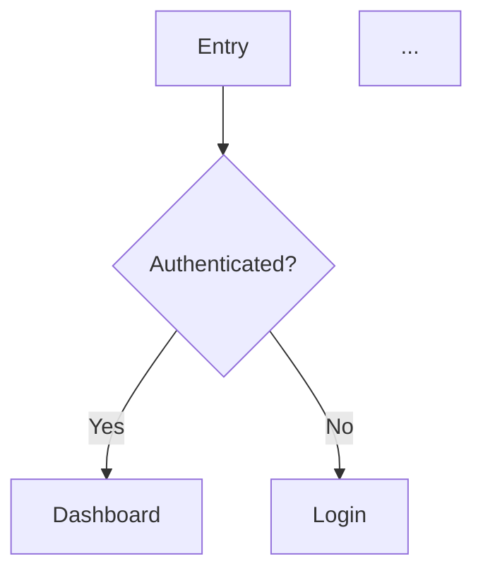

Adopt the **UX Designer** persona defined in `.claude/agents/ux-designer.md` (if installed). Produce a comprehensive UX specification that bridges the problem definition and the technical architecture. Focus on user experience, interaction design, and accessibility.

For visual design aspects (component specs, design tokens, responsive layouts), also reference the **UI Designer** persona in `.claude/agents/ui-designer.md` (if installed).

## Prerequisites

Read these artifacts if they exist:
- `.claude/output/problem.yaml` — problem definition with user stories
- `.claude/output/principles.md` — project principles
- `.claude/output/architecture.yaml` — architecture (if already designed)

If `problem.yaml` does not exist AND no $ARGUMENTS provided:
- Ask the user to describe the product/feature, target users, and key workflows

If $ARGUMENTS is provided, use it as the feature/product description: $ARGUMENTS

## Stage 1: User Analysis

From the problem definition or user description, identify:

- **User personas**: Who are the distinct user types? (name, role, goals, pain points)
- **Key scenarios**: What are the critical user journeys? (3-5 max)
- **Entry points**: How do users arrive? (direct URL, referral, onboarding, deep link)

Present to the user for validation before proceeding.

## Stage 2: User Flows

For each key scenario, design a user flow:

```markdown
### Flow: {Scenario Name}

**Trigger**: {what initiates this flow}
**Actor**: {which persona}
**Goal**: {what the user wants to achieve}

Steps:
1. User {action} → System {response} → Screen: {screen name}
2. User {action} → System {response} → Screen: {screen name}
...
**Success**: {end state}
**Error paths**: {what happens when things go wrong}
```

If appropriate, include a Mermaid flowchart:


## Stage 3: Screen Descriptions (Wireframes in Text)

For each unique screen identified in the flows:

```markdown
### Screen: {Screen Name}

**Purpose**: {what the user accomplishes here}
**URL pattern**: `/{path}` (if web)

**Layout**:
- Header: {nav items, user menu, etc.}
- Main content: {primary elements, their arrangement}
- Sidebar/Secondary: {if applicable}
- Footer: {if applicable}

**Key Elements**:
| Element | Type | Behavior |
|---------|------|----------|
| {name} | button/input/list/card/... | {what it does on interaction} |

**States**:
- Loading: {skeleton/spinner/placeholder}
- Empty: {empty state message and CTA}
- Error: {error display and recovery}
- Success: {confirmation and next action}
```

## Stage 4: Interaction Patterns

Define shared interaction patterns:

**Forms**:
- Validation approach (inline vs on-submit)
- Error message placement and style
- Required field indication
- Auto-save behavior (if applicable)

**Navigation**:
- Primary navigation structure
- Breadcrumbs / back navigation
- Deep linking support

**Feedback**:
- Loading indicators (when and what type)
- Success confirmations (toast, inline, redirect)
- Error handling (inline, modal, page-level)

**Responsive behavior**:
- Breakpoints and layout changes
- Mobile-specific interactions (swipe, pull-to-refresh)
- Touch targets (min 44x44px)

## Stage 5: Component Hierarchy

List the UI components needed, organized by atomic design:

```markdown
### Atoms (basic elements)
- Button (primary, secondary, danger, disabled)
- Input (text, email, password, search)
- ...

### Molecules (composed elements)
- FormField (label + input + error message)
- Card (image + title + description + action)
- ...

### Organisms (complex sections)
- Header (logo + nav + user menu)
- DataTable (headers + rows + pagination + sorting)
- ...

### Templates (page layouts)
- AuthLayout (centered card)
- DashboardLayout (sidebar + header + main)
- ...
```

## Stage 6: Accessibility Requirements

Define accessibility standards:

- **Target**: WCAG 2.1 AA (minimum)
- **Keyboard navigation**: Tab order for each screen, focus management for modals/drawers
- **Screen reader**: ARIA landmarks, live regions for dynamic content, descriptive labels
- **Color**: Contrast ratios, no color-only information, dark mode considerations
- **Motion**: Respect `prefers-reduced-motion`, no auto-playing animations
- **Forms**: Associated labels, error announcements, input descriptions

## Stage 7: Save Output

Save to `.claude/output/ux-spec.md`:

```markdown
# UX Specification

**Date**: {date}
**Based on**: {problem.yaml / user description}

## User Personas
...

## User Flows
...

## Screens
...

## Interaction Patterns
...

## Component Hierarchy
...

## Accessibility
...
```

Ask for confirmation before saving.

Suggest: "This UX spec feeds into `/bmad-model` for architecture design. The component hierarchy informs the implementation backlog."
